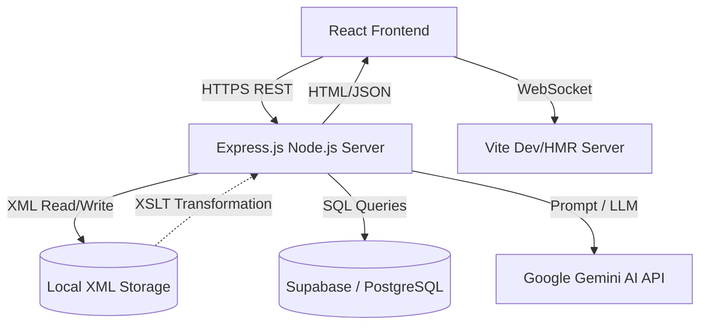

# Rent4Cars - System Documentation

---

  <h1>Rent4Cars</h1>
  <h2>System Documentation & Technical Blueprint</h2>
   
  
<strong>Prepared for:</strong> Mark Welly

  
<strong>Date:</strong> 2026-05-20

---

## 1. System Overview

**Purpose of the System**
Rent4Cars is a comprehensive, full-stack web application designed to streamline the car rental process while providing robust post-booking support. The platform allows users to browse an up-to-date fleet of vehicles, select service hubs for pickup and drop-off, and communicate in real-time with logistics coordinators and AI-augmented expert mechanics for on-the-road troubleshooting.

**Target Users**
The system serves three primary user personas:
1. **Tourists and Travelers:** Individuals needing temporary, reliable transportation with easy-to-use booking features.
2. **Corporate Clients:** Businesses requiring premium fleet vehicles for delegates or extended professional use.
3. **Local Business Owners:** Users who need specific vehicle types (like SUVs or Vans) for logistics and local operations in and around Davao.

---

## 2. System Architecture

**Diagram: Client-Server & Message Flow**

**Technologies Used**
*   **Frontend:** React 19, TypeScript, Tailwind CSS, Framer Motion (for animations).
*   **Backend:** Node.js, Express.js.
*   **Data Structure:** Native XML (for local/document-based structured data logging), Supabase (Remote Database).
*   **AI Integration:** `@google/genai` (For the Mechanic AI).
*   **XML Processing:** `@xmldom/xmldom` (DOMParser, XMLSerializer) and `xslt-processor`.

---

## 3. Feature Descriptions

**Messaging System**
The system features a dual-purpose messaging gateway. Users can contact standard logistics support or engage with a specialized "Mechanic AI" (configured as a Davao-based expert) for real-time car diagnostics. The backend intelligently routes messages and responds asynchronously.

**XML Usage**
To satisfy structural data requirements, the application relies heavily on XML as a localized data layer. Files such as `fleet.xml`, `locations.xml`, and `messages.xml` map out core entities. This ensures the data is strictly structured, portable, and easily parsable by secondary enterprise systems if required.

**Parsing Method**
On the Node.js backend, the system utilizes the `DOMParser` from the `@xmldom/xmldom` library. When the backend receives a request (e.g., fetching fleet details or adding a message), it reads the physical XML file into a string, parses it into an in-memory DOM object, queried/modified using standard DOM methods (`getElementsByTagName`, `createElement`), and serialized back to disk via `XMLSerializer`. 

**XSLT Transformations**
To bridge the gap between strict XML storage and browser-ready presentation, the system utilizes XSLT (Extensible Stylesheet Language Transformations). Stylesheets like `messages_to_html.xslt` and `notifications_report.xslt` are processed on the server to dynamically convert raw XML trees into styled HTML templates, which are then shipped directly to the React frontend.

**Scripting Integration**
TypeScript heavily orchestrates this flow. `server.ts` maps HTTP API endpoints (like `/api/fleet` or `/api/messages`) to file-system operations. The frontend `dataService.ts` scripts manage fetching these endpoints safely, parsing JSON/HTML responses, and mutating the React component states.

---

## 4. Technical Explanation

**How each requirement was implemented**
*   **XML & XSLT:** We created a `/data` directory housing all `.xml` databases and `.xslt` templates. Express routes such as `/api/chat-history` explicitly load `messages.xml`, apply `messages_to_html.xslt` using an XSLT processor, and return text/html to the client.
*   **Mechanic AI:** Implemented using Google Gen AI SDK within the `/api/messages` POST route. It uses a custom system prompt injected before fulfilling user requests.
*   **Client-Server Resilience:** Implemented a retry wrapper (`while (retries > 0)`) inside the frontend `fetch` scripts to prevent the UI from breaking if the backend is actively recompiling.

**Challenges Encountered and Solutions**
1. **Challenge:** *AI Provider Instability & 503 / 429 Errors.* High traffic caused the Gemini AI mechanic to throw `UNAVAILABLE` and rate limit errors, crashing the message loop.
   **Solution:** Implemented robust `try/catch` error boundary logic on the server API. If the API returns a `429` (Quota Reached) or `503`, the system gracefully degrades, logging a manual fallback message warning the user that the AI is under high load.
2. **Challenge:** *Network Desync / "Failed to fetch" on App Startup.* The frontend would attempt to fetch XML data bounds (like Fleet or Locations) before the Express server fully attached to the port.
   **Solution:** Built an automatic 3-retry network backoff mechanism inside `dataService.ts`. If a `TypeError` / network error occurs, it pauses for 1000ms and tries again before throwing an empty array.
3. **Challenge:** *Vite WebSocket Disconnections.* The HMR (Hot Module Replacement) WebSocket kept throwing `"WebSocket closed without opened"` errors due to misaligned HTTP layers in the Express stack.
   **Solution:** Extracted `http.createServer(app)` in `server.ts` and explicitly tied Vite's internal development server to the parent HTTP server instance, stabilizing the websocket pipeline.
